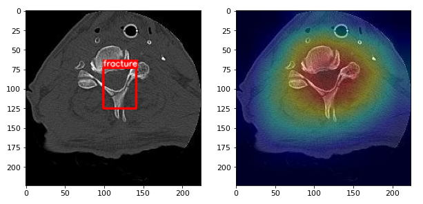

Data Scientist & Machine Learning Engineer 🤗

Some quick visualizations from projects that I did:

| Fracture classification @ [RSNA 2022 competition](https://www.kaggle.com/competitions/rsna-2022-cervical-spine-fracture-detection) | Dolphin detection + background removal @ [Happywhale competition](https://www.kaggle.com/competitions/happy-whale-and-dolphin) |
| --- | --- |
|  |   |
